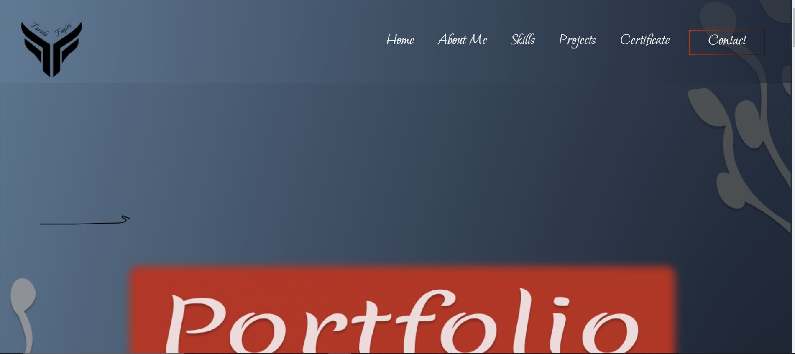
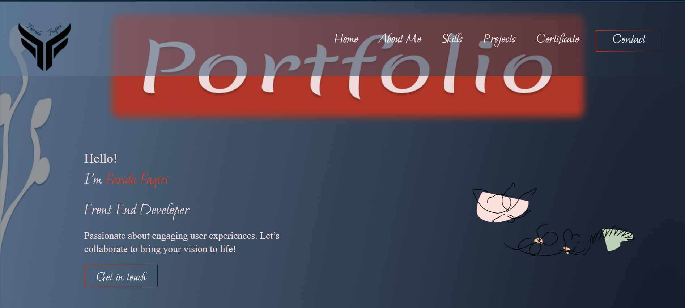
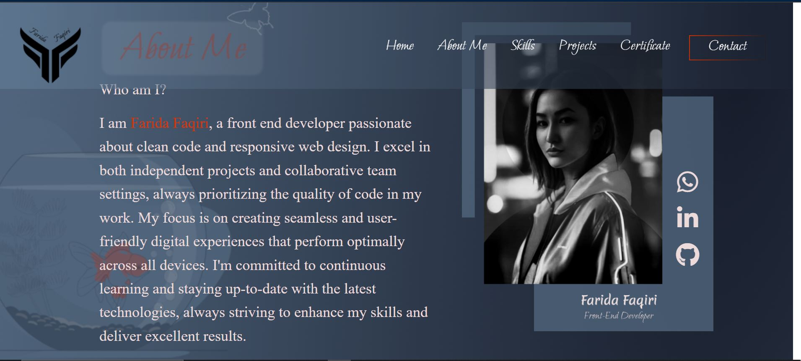
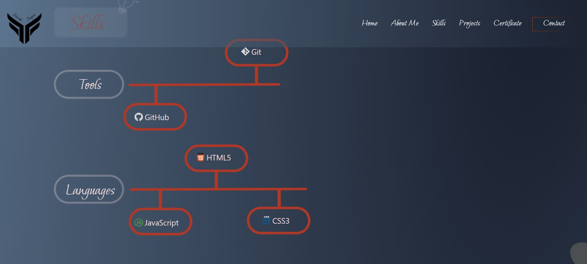
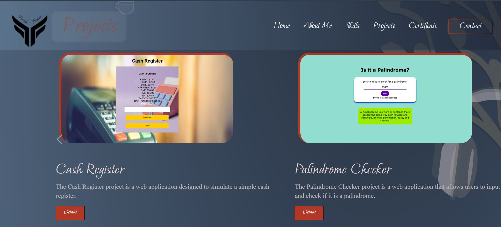
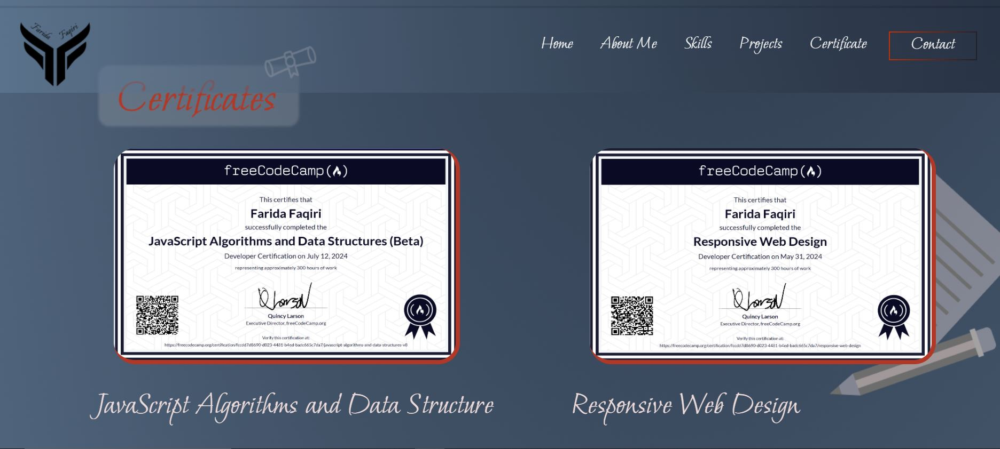
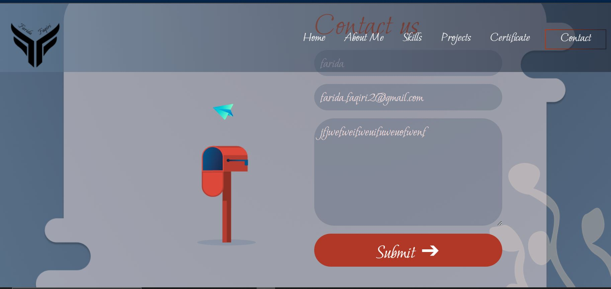

# digital-portfolio

## Portfolio Page Overview 📄

This portfolio web application showcases my skills, projects, and achievements. Developed with HTML, CSS, JavaScript, and Bootstrap, it features a clean and intuitive design, ensuring a seamless user experience. Visitors can navigate through various sections using the responsive navbar, providing easy access to different parts of the portfolio.

## Design and Development Collaboration 👥

This project was brought to life with the combined efforts of talented designers and developers. The design team played a crucial role in crafting the aesthetic and user interface, ensuring a visually appealing and cohesive experience. Their contributions include:

- Visual Design 🎨: Creating a consistent and modern visual style that aligns with current design trends.
- User Experience (UX) 🧩: Focusing on the ease of navigation and interaction to enhance user satisfaction.
- Responsive Layout 📱: Ensuring the design adapts seamlessly to various screen sizes and devices.

## Demo 📸

- Explore the project in action:

## Live Deployment

Check out the live version here: 

## Technologies Used 🛠

This project utilizes:

- HTML
- CSS
- JavaScript
- Bootstrap

## Installation 💻

To run the project locally:

1. Clone the repository to your local machine:

git clone git@github.com:faridafaqiri/Personal-Portfolio.git

2. Navigate to the cloned directory:

cd palindrome-checker

## Usage 🎯

To check if a word or phrase is a palindrome:

1. Enter text into the provided input box.
2. Click the "Check" button to see if it meets the palindrome criteria.

git clone git@github.com:Fikrat2002/palindrome-checker.git

## Key Features 🌟

- Responsive Navbar 🧭: Includes links to Home, About Me, Skills, Projects, Certificates, and Contact sections.
- Home Section 🏠: Displays the portfolio title, creating a strong first impression.
- About Me Section 🙋‍♀️: Introduces the person behind the portfolio, detailing background, interests, and aspirations.
- Skills Section 🛠: Lists relevant technical and soft skills, demonstrating expertise and proficiency.
- Projects Section 💻: Showcases front-end projects with titles, short descriptions, and visuals, highlighting - development capabilities.
- Certificates Section 🎓: Displays front-end development certificates, validating knowledge and accomplishments.
- Contact Section ✉️: Provides a contact form for visitors to reach out via full name, email, and message.
- Features in Detail 🔍
- Bootstrap Integration 🎨: Utilizes Bootstrap for responsive design and consistent styling across different devices.
- Immediate Feedback ⚡️: Users receive real-time updates when navigating through the sections, enhancing engagement.
- User-Friendly Interface 🖱: The design prioritizes ease of interaction, making it accessible for all users.
- Dynamic Content 🔄: Utilizes JavaScript to dynamically generate and display content, ensuring up-to-date information.
- Form Validation ✅: The contact form includes validation to ensure accurate and complete submissions.

## Portfolio design initiated by:

- Hasseeba Baktash
- Latifa Rasouli 

## Designers 👩‍💻

For questions or support, feel free to reach out:

- LinkedIn: [Hasseeba Baktash](http://linkedin.com/in/hasseeba-baktash-822979299)
- Email: [Hasseeba Baktash](hasseebabaktash@gmail.com)

- LinkedIn: [Latifa Rasouli](https://www.linkedin.com/in/latifa-rasouli-64490b2a1)
- Email: [Latifa Rasouli](latifarasouli4@gmail.com)

## Author 👩‍💻

For questions or support, feel free to reach out:

- LinkedIn: (<https://www.linkedin.com/in/farida-faqiri-071a31309/>)
- Email: [farida faqiri](farida.faqiri2@gmail.com)